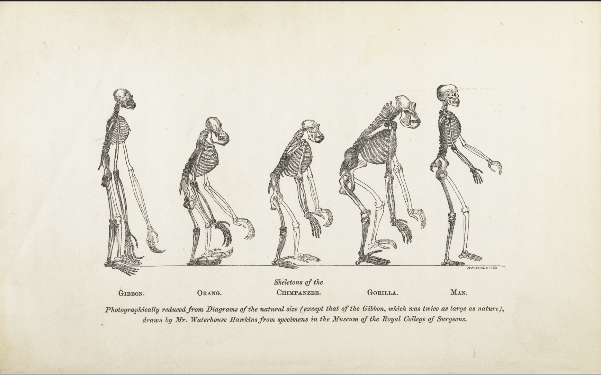

## Welcome to the Iverson Special Collection Project (V2.19).
This site showcases the Darwin Special Collection at UCSB. This is currently a work in progress.
Roadmap & Goals: LONG TERM
>By the end of the december ; have the issues figured out, come up with (and stick too) a controlled vocabulary.

Feedback on the current state of the project can be put [here](https://docs.google.com/forms/d/e/1FAIpQLScRYMDTashOQJDZuH608xJW_tGqDbX_byeKAC1gpd2TTR4vaA/viewform?usp=publish-editor) (it's anonymous ( ´ ω ` ) )

***Note:** Any feed back is loved ; there are some known issues with certain images (for example rotated wrong or seemingly the wrong image showing up). Some of these are errors that I'm not sure what is wrong, others are me forgetting to fix certain rotation issues. Typos and more have not been gone through either ; but if you see any please feel free to point them out. Literally ANY feed back is appreciated. 

